Chapter 02. Introduction : Credibility, Models, and Parameters
========================================================

* 발제 : 김무성
* Book : Doing Bayesian Data Analysis - A Tutorial with R, JAGS, and Stan (EDITION 2)
* 참고자료 : 더 추가하겠습니다.
 - 1. http://posterior.egloos.com/9602501
 - 2. http://posterior.egloos.com/9602693
 - 3. http://posterior.egloos.com/9603023
 - 4. http://posterior.egloos.com/9604153
 - 5. http://posterior.egloos.com/9604165
 - http://datum.io/doingbayesian-ch2-introduction-models-we-believe-in

------------------------------------

# What is Bayesian logic? 

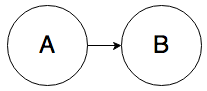

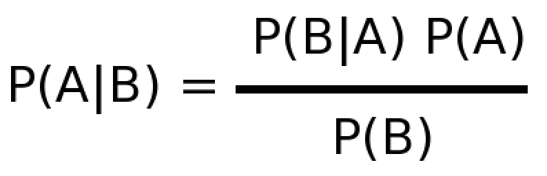

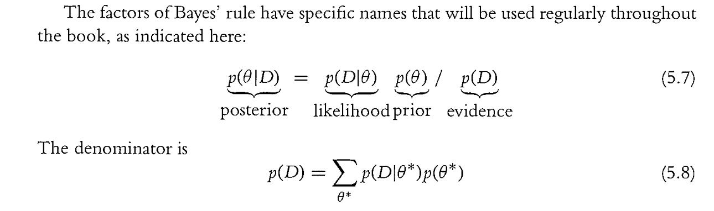

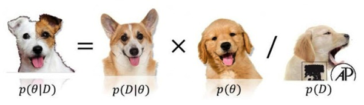

------------------------------------

# Intro : Book Contents

## Chapter 1. Contents

* 1. What's This Book (Read This First!)
 - 1.1 Real people can read this book
 - 1.2 What's in this book
 - 1.3 What's new in the second edition?
 - 1.4 Gimme feedback (be polite)
 - 1.5 Thank you!
 
## PART Contents

* PART I The Basics: Models, Probability, Bayes'Rule, and R
* PART II All the Fundamentals Applied to inferring a Binomial Probability
* PART III The Generalized Linear Model

## PART I The Basics: Models, Probability, Bayes'Rule, and R

* Chapter 2: The idea of Bayesian inference and model parameters. This chapter introduces important concepts; don't skip it.
* Chapter 3: The R programming language. Read the sections about installing the software, including the extensive set of programs that accompany this book. The rest can be skimmed and returned to later when needed.
* Chapter 4: Basic ideas of probability. Merely skim this chapter if you have a high probability of already knowing its content.
* Chapter 5 : Bayes rule!

## PART II All the Fundamentals Applied to inferring a Binomial Probability

* Chapter 6. Inferring a Binomial Probability via Exact Mathematical Analysis
* Chapter 7. Markov Chain Monte Carlo
* Chapter 8. JAGS
* Chapter 9. Hierarchical Models
* Chapter 10. Model Comparison and Hierarchical Modeling
* Chapter 11. Null Hypothesis Significance Testing
* Chapter 12. Bayesian Approaches to Testing a Point("Null") Hypothesis
* Chapter 13. Goals, Power, and Sample Size
* Chapter 14. Stan

## PART III The Generalized Linear Model

* Chapter 15. Overview of the Generalized Linear Model
* Chapter 16. Metric-Predicted Variable on One or Two Groups
* Chapter 17. Metric Predicted Variable with One Metric Predictor
* Chapter 18. Metric Predicted Variable with Multiple Metric Predictors
* Chapter 19. Metric Predicted Variable with One Nominal Predictor
* Chapter 20. Metric Predicted Variable with Multiple Nominal Predictors
* Chapter 21. Dichotomous Predicted Variable
* Chapter 22. Nominal Predicted Variable
* Chapter 23. Ordinal Predicted Variable
* Chapter 24. Count Predicted Variable
* Chapter 25. Tools in the Trunk

-----------------------------------------

# Chapter 2 Contents (Introduction : Credibility, Models, and Parameters)

* 2.1 Bayesian inference is reallocation of credibility across possibilities
* 2.2 Possibilities are parameter values in descriptive models
* 2.3 The steps of bayesian data analysis
* 2.4 Exercies

-------------------------------

# The Goal of this chapter.

* The goal of this chapter is to introduce the concenptual framework of Bayesian data analysis.
* Bayesian data analysis has two foundational ideas.
 - The first idea is that Bayesian inference is reallocation of credibility acroess possibilities.
 - The second foundational idea is that the possibilities, over which we allocate credibility, are parameter values in meaningful mathematical models.
* possibility
* credibility
* parameter
* model

-----------------------------------------

# 2.1. BAYESIAN INFERENCE IS REALLOCATION OF CREDIBILITY ACROSS POSSIBILITIES

* 2.1.1. Data are noisy and inferences are probabilistic

-------------------------------

* e.g. Holmes' reasoning
* a priori
* all possible causes (mutually exclusive and exhaust) -> eliminated -> remaining possible cause
* re-allocated distribution = posterior distribution
* exoneration
* culpability

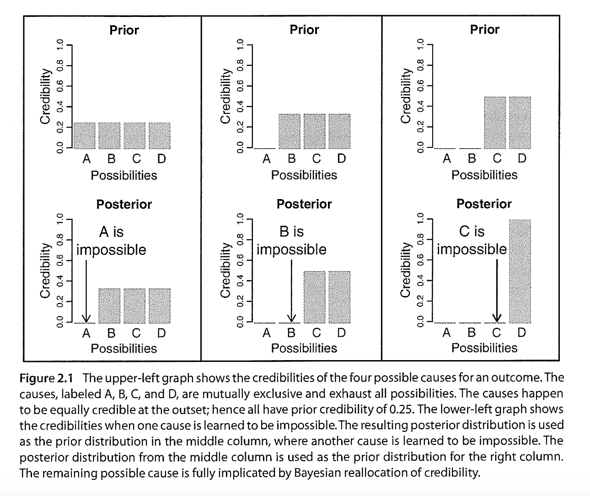

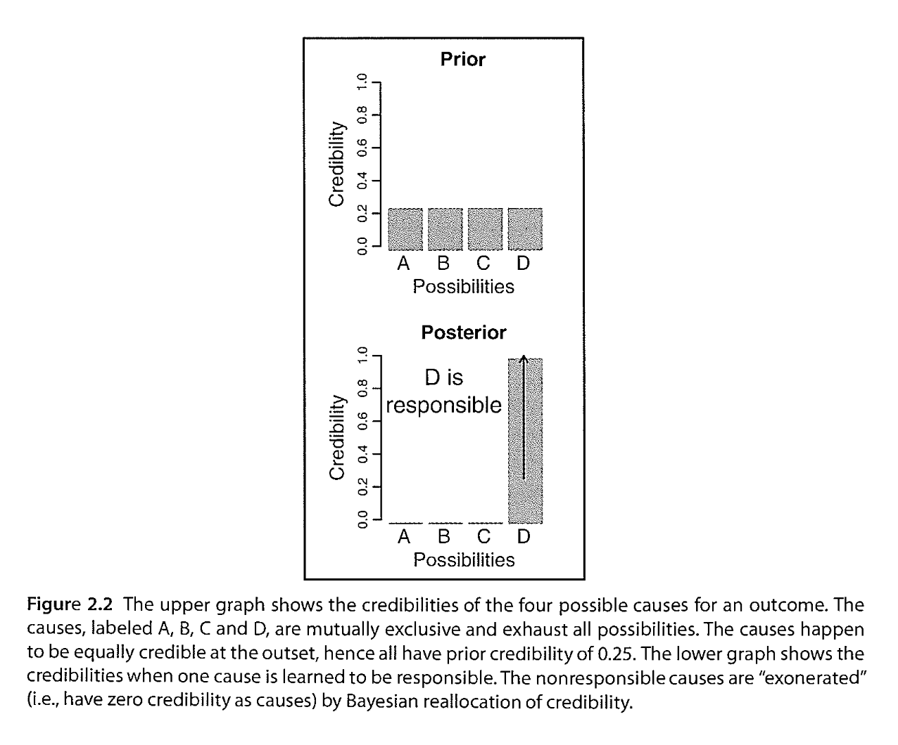

## 2.1.1. Data are noisy and inferences are probabilistic

* noise
 - cause(i.e., the shoe) -> measuered effect (i.e., the footprint)
* probability
* e.g., ball. size(=diametar) = {1.0, 2.0, 3.0, 4.0}
 - random variability in ball diameters
* e.g., drug test
 - false positive, false negative, proir knowledge
 
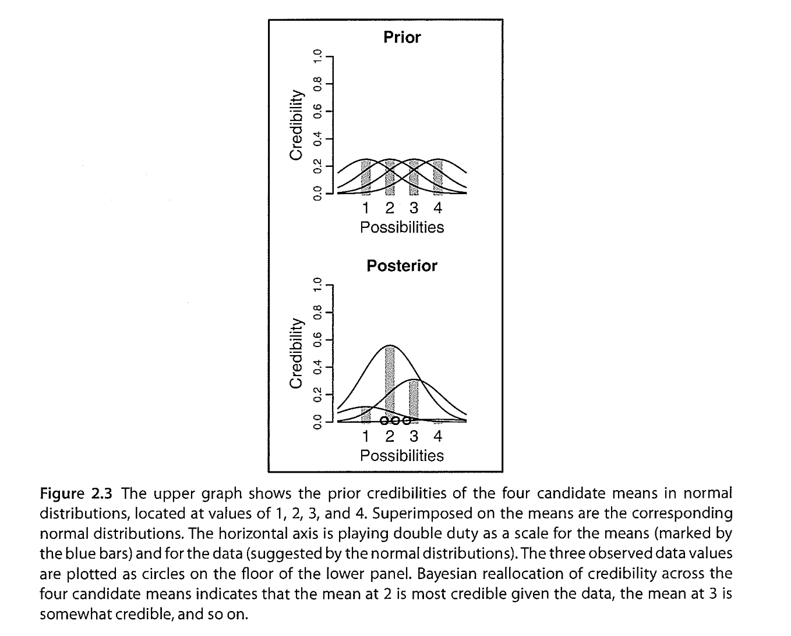

-----------------------------------------

# 2.2. POSSIBILITIES ARE PARAMETER VALUES IN DESCRIPTIVE MODELS

* You can think of parameters as control knobs on mathematical devices that simulate data generation
* e.g. normal distribution
  - mean - a location parameter
  - sd - a scale parameter
* relative credibilities of candidate parameter values

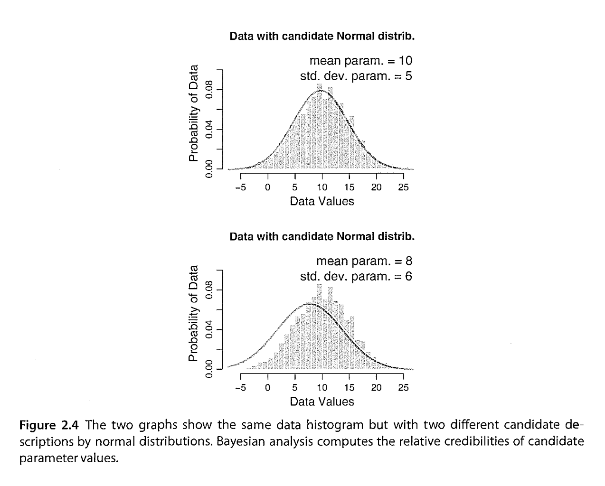

------------------------------------------

# 2.3. THE STEPS OF BAYESIAN DATA ANALYSIS

* 2.3.1. Data analysis without parametric models?

------------------------------------------------

* In general, Bayesian analysis of data follows these steps :
 - Step 1. Identify the data relevant to the research questions. What are the measurement scales of the data? Which data variables are to be predicted, and which data variables are supposed to act as predictors?
 - Step 2. Define a descriptive model for the relevant data. The mathematical form and its parameters should be meaningful and appropriate to the theoretical purposes of the analysis.
 - Step 3. Specify a prior distribution on the parameters. The prior must pass muster with the audience of the analysis, such as skeptical scientists.
 - Step 4. Use Bayesian inference to re-allocate credibility across parameter values. Interpret the posterior distribution with respect to theoretically meaningfull issues (assuming that the model is a resonable description of the data; see next step)
 - Step 5. Check that the posterior predictions mimic the data with resonable accuracy (i.e., conduct a "posterior predictive check"). If not, then consider a different descriptive model. 

* e.g., relationship between weight and height of people
 - step 1. data => 57 mature adults -> (h:continuos scale of inches) * 57, (w:continuous scale of pounds). goal => predict weight ~ height
 - step 2. descriptive model : weight = beta_1 * height + beta_0 => full model : slope(beta_1), intercept(beta_0), sd of the "(weight's)noise"(sigma)
 - step 3. slope & intercept <- I will use a noncommitial and vague prior that places virtually equal prior credibility across a vast range of possible values for the slope and intercept, both centered at zero. / noise <- I will place a vague and noncommittal prior on the noise(standard deviation) parameter, specificaly a uniform distribution that extends from zero to a huge value. 
 - step 4. interpreting the posterior distribution : fig2.5. slope mean, HDI(highest density interval)
 - step 5. posterior predictive check : One approach is to plot a summary of predicted data from the model against the actual data.
 
 
* HDI(highest density interval)
* ? NHST(Null Hypothesis Signification testing) which involves "sampling distributions"" of summary statistics suach as t, from which are computed p values.
* It is important to understand that the posterior distribution in Figgure 2.5 is not a sampling distribution and has nothing to do with p values.

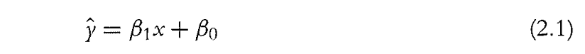

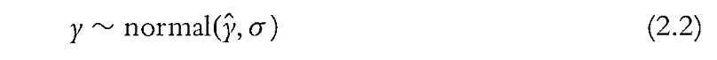

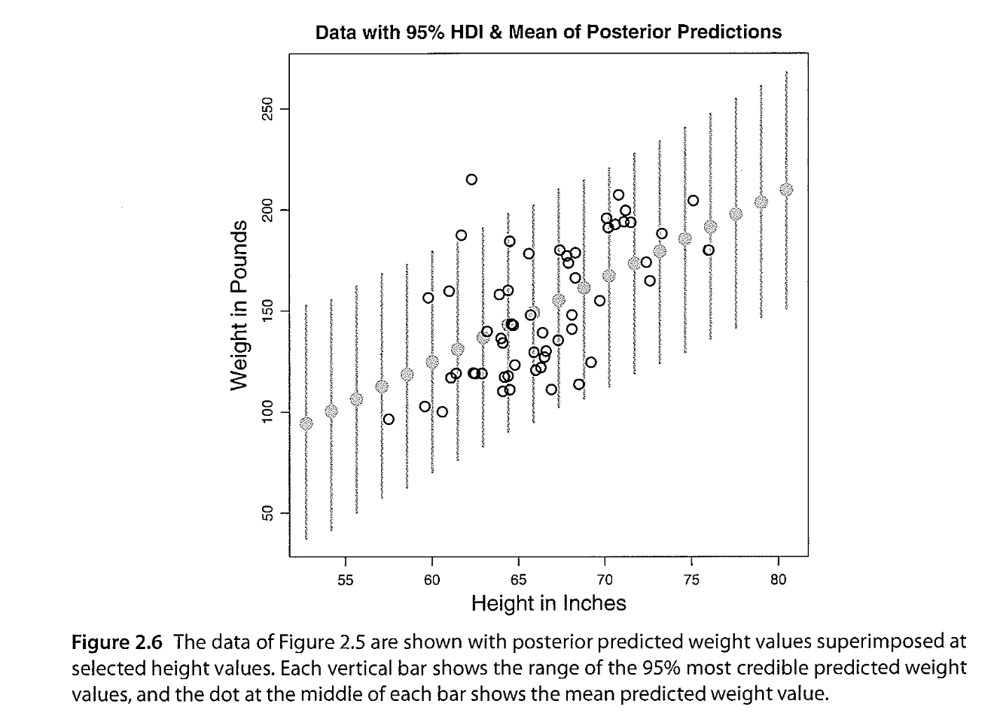

-----------------------------------------------

## 2.3.1. Data analysis without parametric models?

* nonparametric bayesian models ? 
* there might be some situations in which the analyst is loathe to commit to any parmeterized model of the data. -> no Bayesian -> NHST -> resamplikng or bootstrapping -> use p-value

-----------------------------------------

# 2.4. EXERCISE

