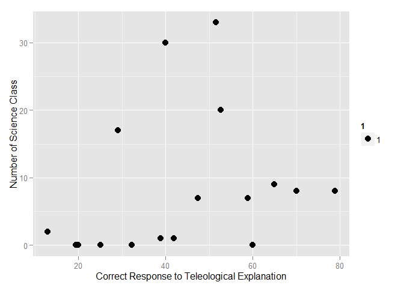
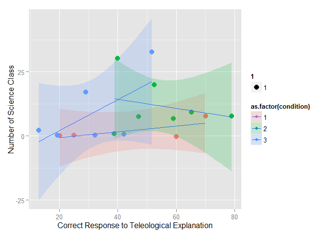
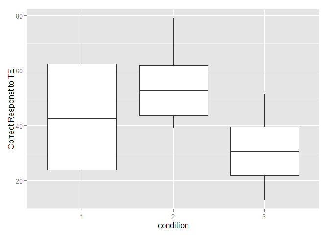

# Ggplot_Example


1. 목적론적 설명 : 대상의 기능이나, 의도 목적에 근거한 설명


예-박쥐들은 모기의 개체수를 조절하기 위해 사냥을 한다.


2. 기계론적 설명: 대상의 근접 기제에 근거한 설명


예-수소원자와 산소원자가 결합해서 물이 된다. 


1.ggplot2 packages

```r
#install.packages("ggplot2)
library(ggplot2)
```

Read data

```r
Replicate <- read.csv("C:/Users/Yoo/Documents/GitHub/bayesianR/part1/ch03/forR.csv", header=T)
<<<<<<< HEAD
Replicate
```

```
##    subject      dv classnum condition
## 1        1 25.0000        0         1
## 2        2 60.0000        0         1
## 3        3 20.0000        0         1
## 4        4 70.0000        8         1
## 5        5 65.0000        9         2
## 6        6 40.0000       30         2
## 7        7 47.3684        7         2
## 8        8 38.8889        1         2
## 9        9 52.6316       20         2
## 10      10 78.9474        8         2
## 11      11 58.8235        7         2
## 12      12 32.2587        0         3
## 13      13 12.9032        2         3
## 14      14 19.3548        0         3
## 15      15 29.0323       17         3
## 16      16 41.9355        1         3
## 17      17 51.6129       33         3
=======
>>>>>>> origin/master
```

dv - 전체 목적론적 설명 중, 틀린 목적론적 설명이 옳다고 판단한 비율

classnum - 대학에서 수강한 과학 관련 수업의 개수

condition- 실험 처치 조건


Scatter Plot

```r
scatter<-ggplot(Replicate,aes(dv,classnum))
scatter+geom_point(aes(size=1))+labs(x="Correct Response to Teleological Explanation",y="Number of Science Class")
```

 

Scatter Plot with Smooth Line

```r
scatter+geom_point(aes(size=1, color=as.factor(condition)),position='jitter')+geom_smooth(method='lm',aes(fill=as.factor(condition)),alpha=0.2)+labs(x="Correct Response to Teleological Explanation",y="Number of Science Class")
```

 

Correlation Coefficient

```r
cor.test(Replicate$dv, Replicate$classnum, method= "pearson")
```

```
## 
## 	Pearson's product-moment correlation
## 
## data:  Replicate$dv and Replicate$classnum
## t = 1.0122, df = 15, p-value = 0.3275
## alternative hypothesis: true correlation is not equal to 0
## 95 percent confidence interval:
##  -0.2593038  0.6540151
## sample estimates:
##      cor 
## 0.252855
```

Boxplot

```r
Boxplot <- ggplot(Replicate, aes(as.factor(condition), dv))
Boxplot+geom_boxplot() +labs(x="condition",y="Correct Responst to TE")
```

 

