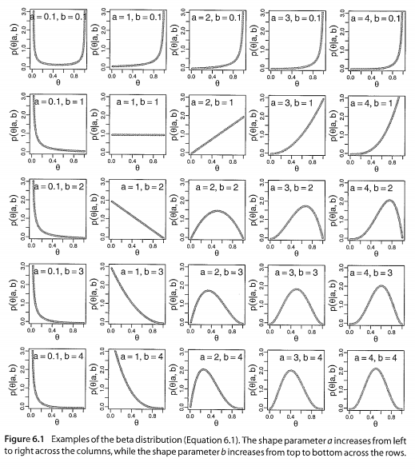

- Date: Mar 18th, 2015
- Created by: Jungwon Choi

*program needed in the book: https://sites.google.com/site/doingbayesiandataanalysis/software-installation/DBDA2Eprograms.zip?attredirects=0&d=1

0. 이거 왜 하나? 
-------------------------
#### *Pure analytical mathematics* 을 이용한 베이지안 추론
- 일부 단순하고, 이상적인 상황에만 적용가능
- 따라서, 복잡한 분포 가정에서는 사용하기 힘들다 (approximation 필요. 예, MCMC)
- 그러나, "연속형 파라미터에 대해서 베이지안 추론"이 무엇인지에 대한 감을 잡는 데에는 유용함
- likelihood 가 _conjugate_  prior distrubution을 가지고 있는 경우 에대해서만 논의하겠다. (특히 이 챕터에서는 __beta distribution__의 경우만)

#### recall:
Bayesian Framework
prior + data(observation) -> posterior distribution


'동전 던지는 상황'으로 내용을 이해해 보자.


1. Likelihood Fuction
-------------------------
recall:

__Bernoulli distribution__
$$latex p(y|\theta) = \theta ^{y}(1-\theta) ^ {(1-y)}$$

two way of interpreting this
- a __probability distrubution__: y a random variable, and $\theta$ a fixed parameter
- a __likelihood function__ : y a fixed observation, and $\theta$ a random variable
$$p(\left \{ y_{i} \right \}|\theta) = \prod_{i}p(y_{i}|\theta) \\=\prod_{i}\theta^{y_{i}}(1-\theta)^{(1-y_{i})}\\=\theta^{\sum_{i}y_{i}}(1-\theta)^{\sum_{i}(1-y_{i})} \\= \theta^{z}(1-\theta)^{N-z}$$


2. Prior나타내기: Beta Distribution
-------------------------


- interval (0,1) 사이의 값을 가지는 $\theta$대한 prior probability를 나타낼 수있는 식이 필요함
- 이 챕터에서처럼 수학적으로 계산이 가능하려면:
다음 베이즈정리의 식에서
$$p(\theta|y) = \frac{p(y|\theta)p(\theta)}{\int p(y|\theta)p(\theta)d\theta }$$

1. 분자부분: 서로같은 형태의 prior $p(\theta)$와 likelihood인 $p(y|\theta)$가 곱해지면 같은 형태의 결과가 나올 것이다  
$p(\theta)$는 $p(y|\theta)$에 대한_conjugate prior_의 형태여야함
2. 분모부분: 적분 가능해야 함


다시 Bernoulli 분포 상황으로 돌아가서, 우리는 prior가 $\theta^{a}(1-\theta)^{b}$와 같이 생겼을 때, Bernoulli 형태의 likelihood를 곱하면, 다시 posterior 분포도 Bernoulli의 형태를띌 것이다.  
이러한 특성을 가지는 분포가 Beta 분포!


**Beta _distribution_**
$$latex p(y|a,b) = beta(y|a,b) = \theta ^{(a-1)}(1-\theta) ^ {(b-1)}/B(a,b)$$
where $B(a,b)$ a normalizing constant

**cf. Beta _function_**
$$latex B(a,b) = \int_{0}^{1}\theta ^{(a-1)}(1-\theta) ^ {(b-1)}d\theta$$ where$0\leq\theta\leq1,\\  a>0\;and\;b>0$


compare with r function
```{r}
x <- seq(0, 1, length = 21)
dbeta(x, 2, 2)
beta(2,2)
```


### (1) beta prior 지정하기
- $\theta$에 대한 우리의 믿음(belief) 반영하기
- 동전던지기 상황을 다시 떠올려서...
  - 사전적으로 a=앞면의 개수 b=뒷면의 개수로 이루어진 총 n번의 시행이 있었다고   가정하자.
  

beta distribution의특성  

mean: $\mu = a/(a+b)$  
mode: $\omega = (a-1)/(a+b-2)$  
for a>1 and b>1  



concentration  
$\kappa = a+b$  

a and b, in terms of kappa, mean and mode  
$a=\mu\kappa\;\;and\;\;b=(1-\mu)\kappa\\a=\omega(\kappa-2)+1\;\;and\;\;b=(1-\omega)(\kappa-2)+1\;\;for\;\;\kappa>2$  

shape parameters  
$a = \mu (\frac{\mu(1-\mu)}{\sigma^{2}})$ and $b = (1-\mu) (\frac{\mu(1-\mu)}{\sigma^{2}})$  

```{r}
source("DBDA2E-utilities.R")
betaABfromMeanKappa(mean=0.25,kappa=4)

betaABfromModeKappa(mode=0.25,kappa=4)

betaABfromMeanSD(mean=0.5,sd=0.1)

betaParam = betaABfromModeKappa(mode=0.25,kappa=4)
betaParam$a
betaParam$b
```


3. The Posterior Beta
-------------------------
prior를 지정하였으면 Bayes Rule로 posterior가 어떠할지 파악해보자
$N$번의 동전던지기 시행 중 $z$번의 앞면이 나왔다고 하면, 베이즈 정리에 따라

$$p(\theta|z,N) = p(z,N|\theta)p(\theta)/p(z,N)\\=\theta^{z}(1-\theta)^{(N-z)}\frac{\theta^{(a-1)}(b-1)^{(b-1)}}{B(a,b)}/p(z,N)\\=\theta^{z}(1-\theta)^{(N-z)}\theta^{(a-1)}(b-1)^{(b-1)}/\left [ B(a,b)p(z,N)) \right ]\\=\theta^{((z+a)-1)}(1-\theta)^{((N-z+b)-1)}/\left [ B(a,b)p(z,N)) \right ]\\=\theta^{((z+a)-1)}(1-\theta)^{((N-z+b)-1)}/B(z+a,N-z+b)$$

동전던지기의 예로 생각해보면:  
- prior는 beta($\theta$|1,1)
- 동전을 던졌더니 앞면이 나왔다
- posterior는 beta($\theta$|2,1)
- 동전을 또 던졌더니 뒷면이 나왔다
- 업데이트된 posterior는 beta($\theta$|2,2)
...
prior가 beta distribution이면 prior도 항상 beta distribution임을 확인할 수 있다.


### (1) posterior distribution은 prior와 likelihood의 타협이다
동전의 예로 mean을 계산하는 경우를 생각해보면,
$$\frac{z+a}{N+a+b} = \frac{z}{N}\frac{N}{N+a+b}+\frac{a}{a+b}\frac{a+b}{N+a+b}$$


4. Example
-------------------------
### (1) 베타분포로 prior를 나타낼 수 있을 때
<상황>
- 갓만든 신선한 정상 동전
- 나의 굳은 믿음으로 mode는 0.5이고, 유효한 샘플 수는 500이라고 가정한다
- 20번 동전을 던져서 17번(85%) 앞면이나옴
- 이 때, 앞면이 나올 확률의 기대값은?

```{r}
source("DBDA2E-utilities.R")  # Load definitions of graphics functions etc.
source("BernBeta.R")          # Load the definition of the BernBeta function

# Specify the prior:
t = 0.5             # Specify the prior MODE.
n = 500              # Specify the effective prior sample size.
a = t*(n-2) + 1      # Convert to beta shape parameter a.
b = (1-t)*(n-2) + 1  # Convert to beta shape parameter b.

Prior = c(a,b)       # Specify Prior as vector with the two shape parameters.

# Specify the data:
N = 20                         # The total number of flips.
z = 17                         # The number of heads.
Data = c(rep(0,N-z),rep(1,z))  # Convert N and z into vector of 0's and 1's.

openGraph(width=5,height=7)
posterior = BernBeta( priorBetaAB=Prior, Data=Data , plotType="Bars" , 
                      showCentTend="Mode" , showHDI=TRUE , showpD=FALSE )
saveGraph(file="BernBetaExample",type="png")

```

위의 예제를 활용해서 다양한 상황에 응용할 수 있다.

### (2) 베타분포로 prior를 나타낼 수 없는 경우
<상황>
- 이상한 회사에서 2가지 동전을 생산한다: 앞면이 나올 확률이 25%인 동전과, 앞면이 나올 확률이 75%인 동전
- 이 때, prior distribution은 bimodal한 형태를 띠게 됨


(다시 grid approxomation으로...)
```{r}
source("BernBeta.R")
source("BernGrid.R")

Theta <- seq(0,1,length=1000)
pTheta <- c(rep(1,200),seq(1,100,length=50),seq(100,1,length=50),rep(1,200),
           rep(1,200),seq(1,100,length=50),seq(100,1,length=50),rep(1,200))
pTheta <- pTheta/sum(pTheta)


Data <- c(rep(0,13),rep(1,14))
posterior <- BernGrid(Theta, pTheta,Data,plotType="Bars",
                      showCentTend="None", showHDI=FALSE, showpD=FALSE)
```

