* 베이지안 통계 R
* [Doing Bayesian Data Analysis, Second Edition: A Tutorial with R, JAGS, and Stan](https://sites.google.com/site/doingbayesiandataanalysis/)
* [Source Code](https://github.com/boboppie/kruschke-doing_bayesian_data_analysis)
* [Exercises and solutions](https://sites.google.com/site/doingbayesiandataanalysis/exercises/Kruschke-DBDA2E-ExerciseSolutions.pdf?attredirects=0&d=1)
* [Latex](http://www.codecogs.com/latex/eqneditor.php)

# Contents

* 9.1. A Single Coin from a Single Mint
* 9.2. Multiple Coins from a Single Mint
* 9.3. Shrinkage in Hierarchical Models
* 9.4. Speeding up JAGS
* 9.5. Extending the Hierarchy: Subjects Within Categories

Hierarchical model?

 Mathematical descriptions involving multiple parameters such that the credible values of some parameters meaningfully depend on the values of other parameters.
 
 example) coins minted from the same factory. $\omega$ - bias of the factory, $\theta_{s}$ - bias of the coins (where the subscript indexes different coins). </br>Credible values of $\theta_{s}$, depend on the values of $\omega$.
 
 examples) batting ability ofbaseball players who have different primary fielding positions, probability that a child bought lunch from the school cafeteria, in different schools in different districts, probability that patients recover from heart surgery performed by different surgical teams within different hospitals in different cities, etc.


The parameters at different levels in a hierarchical model coexist in a joint parameter space. 

$$ p(\theta,w|D) \propto (D|\theta,w)p(\theta,w) = p(D|\theta)p(\theta | w)p(w) \quad (9.1) $$

The data depend only on the value of $\theta$ in the sense that when the value $\theta$ set then the data are independent of all other parameter values. </br>
$\theta$ depends on the value of w and the value of $\theta$ is conditionally independent of all other parameters.

The dependencies among parameters become useful. 
1. For the given application.
2. All the data can jointly inform all the parameter estimates.
3. The dependencies can facilitate efficient Monte Carlo sampling from the posterior distribution, because clever algorithms can take advantage of conditional distributions (ex: Gibbs sampling uses conditional distributions).

Real-world data involving dichotomous outcomes

- Coin flip
- Recovery or nonrecovery from a disease after treatment
- Recalling or forgetting a studied item
- Choosing candidate A or candidate B in an election

- Therapeutic touch
- Extrasensory perception
- Baseball batting ability

## 9.1. A Single Coin from a Single Mint

The likelihood function is the Bernoulli distribution.</br>
$$ \gamma_{i} \sim dbern(\theta)\quad (9.2) $$

The prior distribution is a beta density.</br>
$$ \theta\sim dbeta(a, b) \quad (9.3) $$

**Reference in Chapter 6 (p129)**
Our goal is to convert a prior belief expressed in terms of central tendency and sample size into equivalent values of a and b in the beta distribution. </br>
Toward this goal, it is useful to know the *central tendency* and *spread of the beta distribution* expressed in terms of *a* and *b*. </br>
It turns out that the mean of the beta($\theta|a$, b) distribution is $\mu = a/(a+b)$ and the mode is $\omega=(a-1)/(a+b-2)$ for a > 1 and b > 1. </br>
Thus, when a = b, the mean and mode are 0.5. When a > b, the mean and mode are greater than 0.5, and when a < b, the mean and mode are less than 0.5. </br>
The spread ofthe beta distribution is related to the "concentration" K = a+ b. You can see from Figure 6.1 that as K = a + b gets larger, the beta distribution gets narrower or more concentrated.

The shape parameters of the beta density, a and b, can be re-expressed in terms of the mode $\omega$ and concentration K of the beta distribution: $a = \omega(K-2) + 1$ and $b = (1-\omega)(K-2) +  1$, where $\omega = (a-1)/(a+b-2)\ and\ K = a + b$</br>
$$ \theta \sim dbeta (\omega(K-2)+1, (1-\omega)(K-2)+1) \quad (9.4) $$

$\theta$ depends on the value of $\omega$.
K governs how near $\theta$ is to W, with larger values of K generating values of $\theta$ more concentrated near $\omega$.
Thus, the magnitude of K is an expression of our prior certainty regarding the dependence of $\theta$ on $\omega$. 

The larger K is, the more consistently the mint makes coins with $\theta$ close to $\omega$. 

$$ p(\omega) = beta(\omega | A_{w}, B_{w}) \quad (9.5) $$

$\omega$ is typically near $(A_{w} - 1)$/$(A_{w} + B_{w} - 2)$ (mode of the beta distribution)

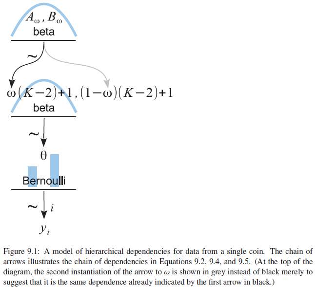


$$ p(\theta,\omega|\gamma)= \frac{p(\gamma|\theta,\omega)p(\theta,\omega)}{p(\gamma)} $$
$$=\frac{p(\gamma|\theta)p(\omega|\theta)p(\omega)}{p(\gamma)}
\quad(9.6) $$

The three terms of the numerator in second line
1. The likelihood function is a Bernoulli distribution in Equation 9.2
2. The dependence of $\theta$ on $\omega$ is specified to be a beta density in Equation 9.4.
3. The prior distribution on $\omega$ is a beta density in Equation 9.5. 

The likelihood and prior can be re-expressed as a hierarchical chain of dependencies among parameters

 1. Important in
  - Human interpretation
  - Hierarchical models can be parsed for MCMC samplers very effectively
 2. Applications
  - Meaningful chain of dependencies is primary in the conceptual genesis of the model
  - Thinking of the model as a joint distribution on a joint parameter space

### 9.1.1. Posterior via grid approximation
When the parameters extend over a finite domain, and there are not too many of them, then we can approximate the posterior via grid approximation.

The prior distribution has $A_{\omega}$ = 2, $B_{\omega}$ = 2, and K = 100 in Figure 9.2. </br>
$p(\theta,\omega) = p(\theta|\omega)p(\omega) = beta(\theta|\omega(100- 2) +1, (1- \omega)(100- 2) + 1) beta(\omega|2, 2)$.

As this is a grid approximation,

1. The joint prior **p($\theta$, $\omega$) = p($\theta$, $\omega$) * p($\omega$)** at every grid point
2. Dividing by their sum across the entire grid.
3. The normalized probability masses -> (converted to) -> estimates of <u>probability density</u> at each grid point

by dividing each probability mass by the area of a grid cell.

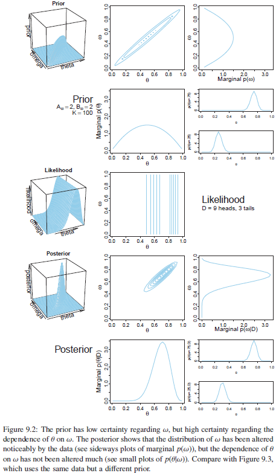

prior p($\omega$), posterior p($\omega|{\gamma_{i}}$) => different </br>
Impact on beliefs about how $\omega$ is distributed </br>
$\because$ prior: uncertain => easily influenced by the data.

</br></br>
High prior certainty regarding $\omega$, low prior certainty regarding the dependence of $\theta$ on $\omega$. </br>
Figure 9.3 illustrates such a case, where $A_{\omega}$ = 20, $B_{\omega}$ = 20, and $K$ = 6. 

The likelihood graphs look the same in the two figures. </br>
The contour lines are parallel to the $\omega$ axis => $\omega$ has no influence on the likelihood.


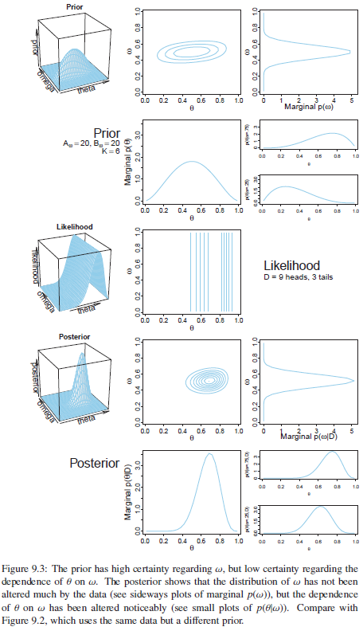


**Comparison**

In Figure 9.2

* Low prior certainty on $\omega$ (small $A\omega$,$B\omega$)
* High prior certainty about the dependence of $\theta$ on $\omega$ (large $K$).
* The posterior distribution showed a big change in beliefs about $\omega$, but not much change in beliefs about the dependence of $\theta$ on $\omega$.

In Figure 9.3

* Complementary situation
* High prior certainty on $\omega$ and low prior certainty about the dependence of $\theta$ on $\omega$.


## 9.2. Multiple Coins from a Single Mint

$\theta_{s}$ : probability of remembering by subjects </br>
$\omega$ : random variation of subjects around the drug-induced tendency </br>
$\theta_{s} \sim dbeta(\omega(K-2)+1, (1 - \omega)(K - 2) + 1)$: subjects' variation around $\omega$,  K: fixed constant </br>
$\gamma_{i|s} \sim dbern(\theta_{s})$, where the subscript, i|s, indicates the ith observation within subjects

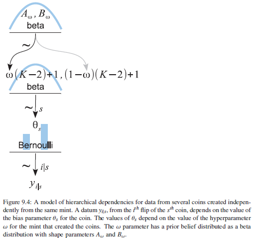


### 9.2.1 Posterior via grid approximation

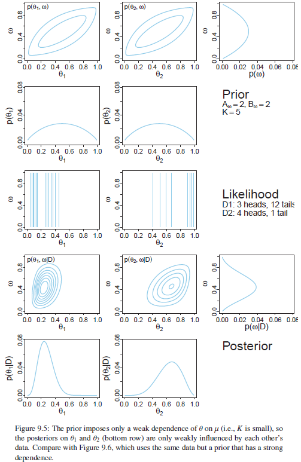


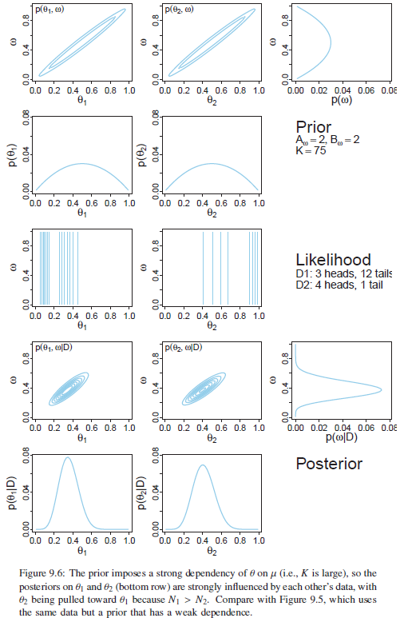


The grid approximation displayed in Figures 9.5 and 9.6 used combs of only 50 points on each parameter ($\omega$, $\theta_{1}$, and $\theta_{2}$). 

In Figure 9.6, the prior on $\omega$ is the same gentle peak, </br> but the prior dependency of $\theta_{s}$ on $\omega$ is much stronger (K = 75 instead of K = 5).

This shift away from the data proportion of subject 2 is caused by the fact that the other coin had a larger sample size </br> => $\therefore$  more influence on the estimate of $\omega_{2}$
=> influence the estimate of $\theta_{2}$.

The values of the prior and likelihood at a large number of grid points and sums over them to determine the denominator of Bayes' rule.

Grid approximation is not a viable approach to even modestly large problems.

### 9.2.2 A realistic model with MCMC

When K of the concentration or consistency parameter was fixed at a large value, the individual $\theta_{s}$ values stayed close to $\omega$ </br>
When K was fixed at a small value, $\theta_{s}$ values could roam quite far from $\omega$.

=> In real situations, we do not know the value of K in advance!

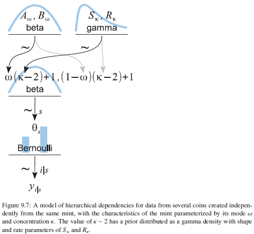


The *gamma(K|s,r)* distribution is a probability density for k ≥ 0, with two parameters that determine its exact form, called its *shape s* and *rate r* parameters.

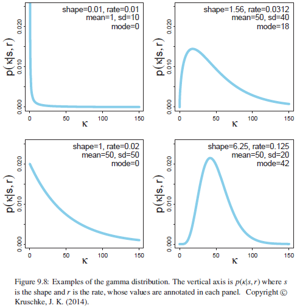

Prior beliefs are most intuitively expressed in terms of the *central tendency* and a *width of the distribution*.</br>
$\therefore$ useful to start with values for central tendency and width, and convert them into corresponding shape and rate values.

Mean of the gamma distribution: $\mu = s/\gamma$ </br>
Mode of $\omega=(s-1)/\gamma , s>1$ </br>
Standard deviation $\sigma = \sqrt{s}/\gamma$ </br> 

$$s=\frac{\mu^{2}}{\sigma^{2}}, \gamma=\frac{\mu}{\sigma^{2}},for\quad\mu>0\ (9.7)$$
$$s=1+\omega\gamma\ where\ \gamma=\frac{\omega+\sqrt{\omega^{2}+4{\sigma}^{2}}}{2{\sigma}^{2}}\ for\ mode\ omega>0\ (9.8)$$ 


```{r chunk9.1}
#install.packages("knitr")
library(knitr)

#install.packages('rjags')
require(rjags)

#setwd("D:/Study/Bayesian/bayesianR/ch09")
source("DBDA2E-utilities.R")
gammaShRaFromMeanSD(mean=10, sd=100)

gammaShRaFromModeSD(mode=10, sd=100)
gammaParam = gammaShRaFromModeSD(mode=10, sd=100)
gammaParam$shape
gammaParam$rate
```


### 9.2.3. Doing it with JAGS
The arrows in the hierarchical diagram indicate the dependencies between the variables. Every arrow in the diagram has a corresponding expression in the JAGS model specification. 

```{r chunk9.2}
# Define the model:
#modelString = "
#model {
#  for ( i in 1:Ntotal ) {
#    y[i] ~ dbern( theta )
#  }
#  theta ~ dbeta( 1 , 1 )
#}

#model {
#  for ( i 1n l:Ntotal ) {
#    y[i] ~ dbern( theta[s[i]])
#  }
#  for ( s in 1:Nsubj ) {
#    theta[s] - dbeta( omega*(kappa-2)+1,  (1-omega)*(kappa-2)+1 )
#  }
#  omega ~ dbeta( l , l )
#  kappa <- kappaMinusTwo + 2
#  kappaMinusTwo - dgamma( 0.01 , 0.01 ) # mean=1 , sd=10 (generic vague)
#}
```

### 9.2.4 Example: Therapeutic touch
Therapeutic touch is a nursing technique in which the practitioner manually manipulates the "energy field" of a patient who is suffering from a disease. 
(Rosa, Rosa, Sarner, and Barrett (1998))
Each trial by flip of the coin -> The practitioner guess -> Each trial was scored as correct or wrong.

- Each 21 practitioner for 10 trials
- 7 practitioner tested twice approximately a year apart
- 30 paramters

=> How much the group as a whole or any individuals differed from chance performance(=0.50)?

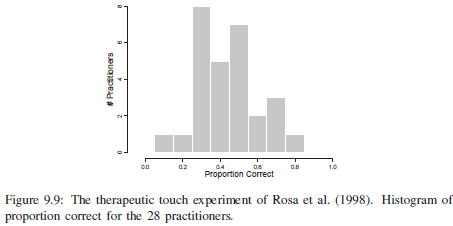

Contents of 'TherapeuticTouchData.csv' </br>
y: outcome of the trials (0 or 1) </br>
s: identifier of the subject who generated each outcome </br>
s Name, y Name in the functions genMCMC and plotMCMC </br>


```{r chunk9.3}
#Read the data file:
myData = read.csv("TherapeuticTouchData.csv")
# Load the relevant model functions into R's working memory:
source("Jags-Ydich-XnomSsubj-MbernBetaOmegaKappa.R")
# Generate the MCMC chain: 
mcmcCoda = genMCMC(data=myData, sName="s", yName="y",
numSavedSteps=20000 , thinSteps=10)
```

```{r chunk9.4}
#Display diagnostics of chain, for specified parameters:
diagMCMC (codaObject=mcmcCoda, parName="omega")
```
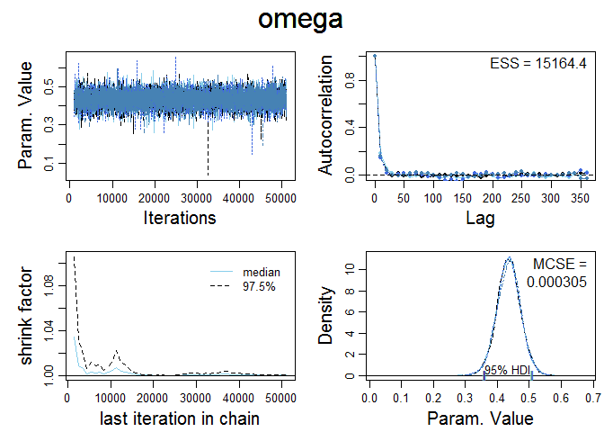

**Output 9.1**


```{r chunk9.5}
diagMCMC (codaObject=mcmcCoda, parName="kappa")
```

```{r chunk9.6}
diagMCMC (codaObject=mcmcCoda, parName="theta[1]")
```

```{r chunk9.7}
# Get summary statistics of chain:
# diffIdVec: vector of subject indices that should have their posterior differences summarized.
smryMCMC (mcmcCoda, compVal=0.5, diffIdVec=c(1,14,28), compValDiff=0.0)

# Display posterior information:
plotMCMC (mcmcCoda, data=myData, sName="s", yName="y",
compVal=0.5, diffIdVec=c(1,14,28), compValDiff=0.0)
```
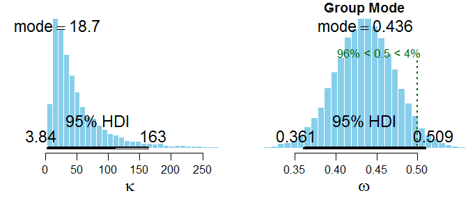

**Output 9.2: same as Figure 9.10 upper pannel**

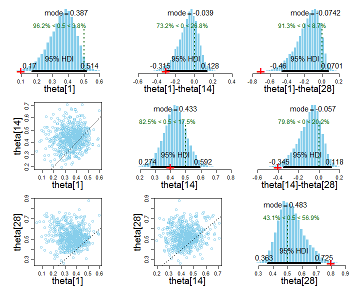

**Output 9.3: same as Figure 9.10 lower pannel**


Only the kappa parameter showed high autocorrelation => typical of higher-level parameters that control the variance of lower-level parameters. 

The chains for K show good overlap. 
The marginal posterior on K spans a wide range of values, and the estimates of the other parameters are not hugely affected by small changes in K.

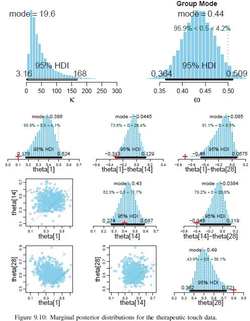

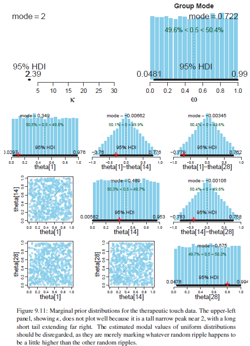


It can be seen that the prior for the therapeutic touch data is uniform on the group-level mode, $\omega$, and uniform on each of the individual level biases, $\theta_{s}$. </br>
=> equal prior credibility to any possible bias.

The priors on the differences of individual biases: triangular distributions, peaked at a difference of zero.


## 9.3. Shrinkage in Hierarchical Models

Shrinkage of the estimates in hierarchical models: the estimates of low-level parameters are pulled closer together if there were not a higher-level distribution. </br>

In Figure 9.10, the most credible values of individual-level biases, $\theta_{s}$, were closer to the group-level mode, $\omega$, than the individual proportions correct, $z_{s}/N_{s}$. </br>
*$\therefore$* The variance between the estimated values $\theta_{s}$ is less than the variance between the data values $z_{s}/N_{s}$.
Shrinkage leads to reduced variance only for unimodal distributions of parameters. </br>
Shrinkage causes low-level parameters to shift toward the modes of the higher-level distribution. </br> 

Concept at the book's [blog](http://doingbayesiandataanalysis.blogspot.kr/2012/11/shrinkage-in-multi-level-hierarchical.html)


Examples at the book's [blog](http://doingbayesiandataanalysis.blogspot.com/2013/03/shrinkage-in-bimodal-hierarchical.html) and in Kruschke and Vanpaemel (in press).

Shrunken parameter estimates are less affected by random sampling noise than estimates derived without hierarchical structure.</br> Shrinkage occurs because the estimate ofeach low-level parameter is influenced from two sources: </br>
(1) the subset ofdata that are directly dependent on the low-level parameter </br>
(2) the higher-level parameters on which the low-level parameter depends. </br>

It is important to understand that shrinkage is a consequence of hierarchical model structure, not Bayesian estimation.

Maximum likelihood estimate (MLE) for the hierarchical model of Figure 9.7

$$ p(\gamma_{i|s} | \theta_{s}, \omega, K) $$
$$ = bern(\gamma_{i|s}) · beta(\theta_{s}|\omega(K-2)+1, (1-\omega)(K-2)+1)\ (9.9) $$

For the whole set of data, $\gamma_{i|s}$, because we assume independence across data values, we take the product of that probability across all the data:
$$p({\gamma_{i|s}}|{\theta_{s},w,k})$$
$$=\prod_{s}\prod_{i|s}p({\gamma_{i|s}}|\theta_{s},w,k)$$
$$=\prod_{s}\prod_{i|s}bern({\gamma_{i|s}}|\theta_{s})\cdot beta(\theta_{s}|w(k-2)+1,(1-w)(k-2)+1)\ (9.10)$$


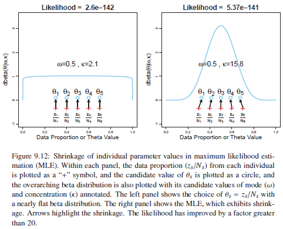


## 9.4. Speeding up JAGS

Methods to speed up processing ofJAGS. 
- changes the likelihood function in the JAGS model specification. - runjags package to run chains in parallel on multicore computers. 

Use the binomial likelihood function instead of the Bernoulli likelihood. </br>
$$p(Z_{s}|\theta_{s},N_{s}) = \binom{N_{s}}{Z_{s}}\theta_{s}^{Z_{s}}(1-\theta_{s})^{(N_{s}-Z_{s})}$$


=> remove constant called binomial codefficient, $\binom{N_{s}}{Z_{s}}$ for JAGS by using its built-in binomial likelihood


```{r chunk9.8}
#z = aggregate( y , by=list(s) , FUN=sum )$x
#N = aggregate( rep(1,length(y)) , by=list(s) , FUN=sum )$x
#Nsubj = length(unique(s))
# Specify the data in a list, for later shipment to JAGS:
#dataList = list(
#  z = z ,
#  N = N ,
#  Nsubj = Nsubj
#)


#model {
#  for ( s in 1:Nsubj ) {
#    z[s] ~ dbin( theta[s] , N[s] )
#    theta[s] ~ dbeta( omega*(kappa-2)+1 , (1-omega)*(kappa-2)+1 ) 
#  }
#  omega ~ dbeta( 1 , 1 )
#  kappa <- kappaMinusTwo + 2
  #kappaMinusTwo ~ dgamma( 0.01 , 0.01 )  # mean=1 , sd=10 (generic vague)
#  kappaMinusTwo ~ dgamma( 1.105125 , 0.1051249 )  # mode=1 , sd=10 
#}

#source("Jags-Ydich-XnomSsubj-MbinomBetaOmegaKappa.R")
```


## 9.5. Extending the Hierarchy: Subjects Within Categories

Data with many dichonomous value, different categries

```{r chunk9.9}
# Read the data
myData = read.csv("BattingAverage.csv")
# Load the relevant model into R's working memory:
source("Jags-Ybinom-XnomSsubjCcat-MbinomBetaOmegaKappa.R")
# Generate the MCMC chain => Takes few minutes
mcmcCoda = genMCMC(data=myData,
                   zName="Hits", NName="AtBats", sName="Player",
                   cName="PriPos", numSavedSteps=11000, thinSteps=20 )
# Display diagnostics of chain, for specified parameters:
for ( parName in c("omega[1]","omegaO","kappa[1]","kappaO", "theta[1]")) {
  diagMCMC( codaObject=mcmcCoda, parName=parName,
            #saveName=fileNameRoot, saveType=graphFileType #Error in diagMCMC(codaObject = mcmcCoda, parName = parName, saveName = fileNameRoot,  :   object 'fileNameRoot' not found
            #saveName=".", saveType=graphFileType #Error in paste0(file, ".", type) : object 'graphFileType' not found
          )
}
```

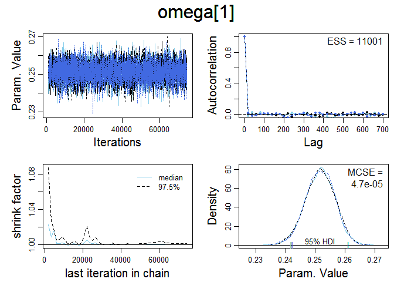</br>
**Output 9.4**

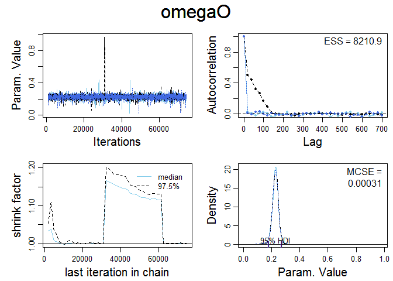</br>
**Output 9.5**

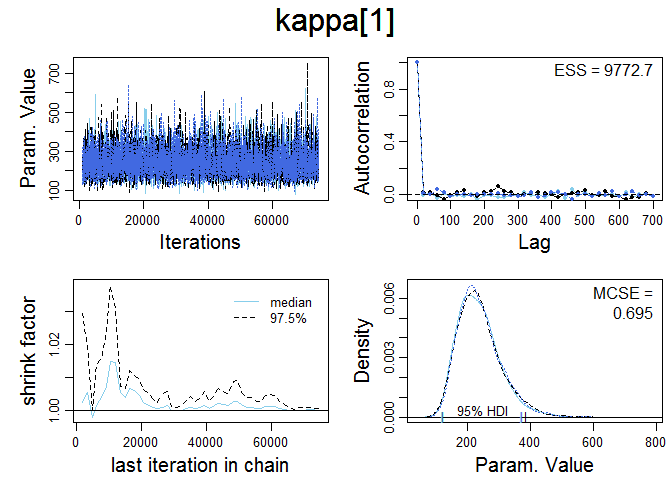</br>
**Output 9.6**

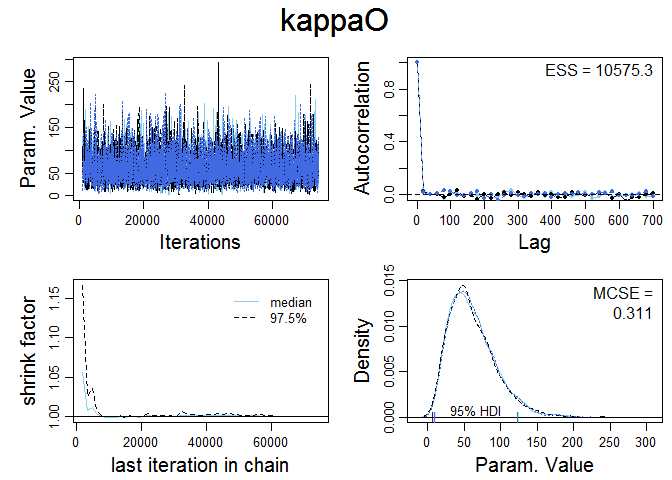</br>
**Output 9.7**

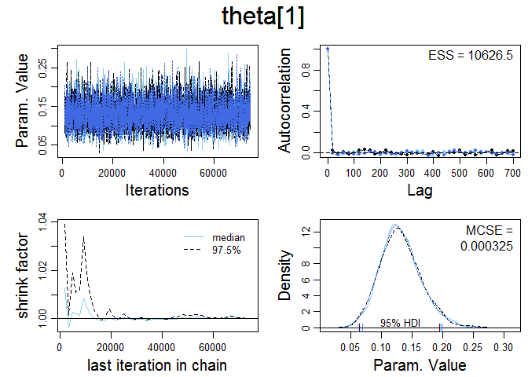</br>
**Output 9.8**


```{r chunk9.10}
# Get summary statistics of chain:
summaryInfo = smryMCMC(mcmcCoda, compVal=NULL)
# Display posterior information:
plotMCMC(mcmcCoda, data=myData,
        zName="Hits", NName="AtBats", sName="Player", cName="PriPos",
        compVal=NULL ,
        diffCList=list( c("Pitcher", "Catcher"), c("Catcher","1st Base") ),
        diffSList=list( c("Kyle Blanks","Bruce Chen"),
                        c("Mike Leake","Wandy Rodriguez"),
                        c("Andrew McCutchen", "Brett Jackson"),
                        c("ShinSoo Choo","Ichiro Suzuki") ),
        compValDiff=0.0)
```

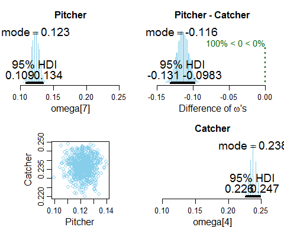

**Output 9.11: same as Figure 9.14 left panel**

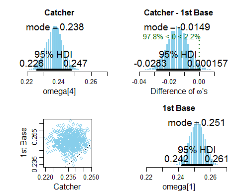

**Output 9.12: same as Figure 9.14 right panel**

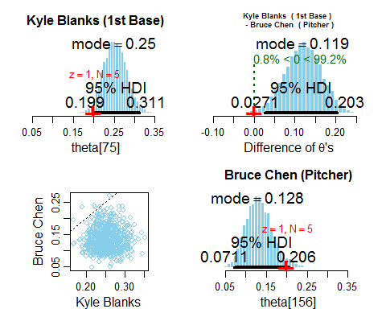

**Output 9.13: same as Figure 9.15 left panel**

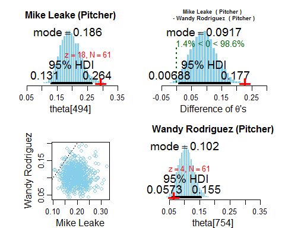

**Output 9.14: same as Figure 9.16 left panel**

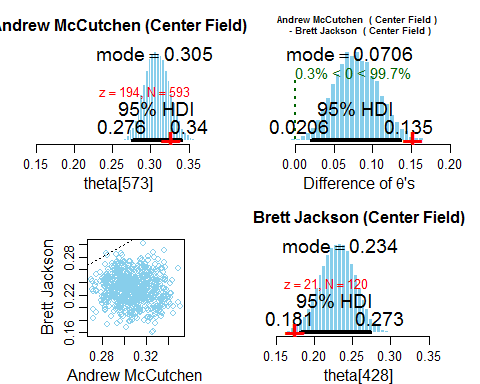

**Output 9.15: same as Figure 9.16 right panel**

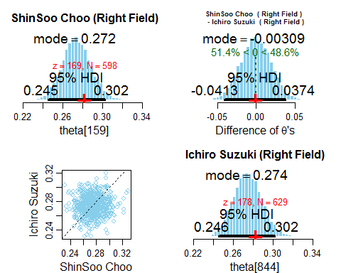

**Output 9.16: same as Figure 9.15 right panel**


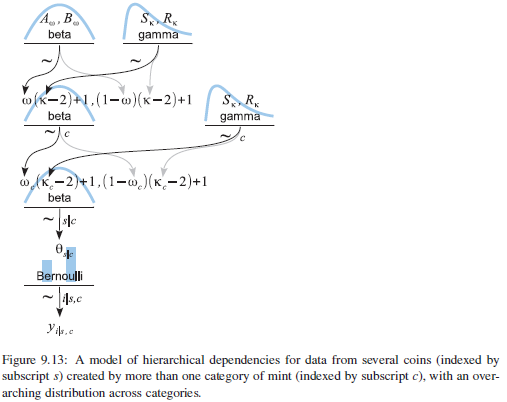


### 9.5.1 Example: Baseball batting abilities by position [book's blog](http://doingbayesiandataanalysis.blogspot.com/2012/11/shrinkage-in-multi-level-hierarchical.html)

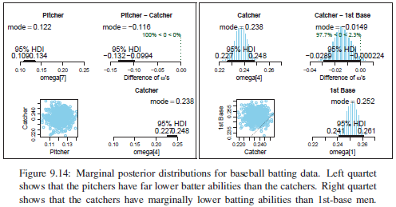

=> Position-level batting abilities ($\omega$ in modeling)

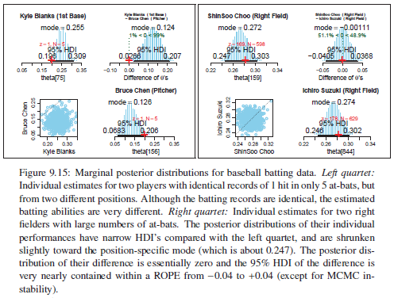

=> Abilites of selected individuals with identical batting records

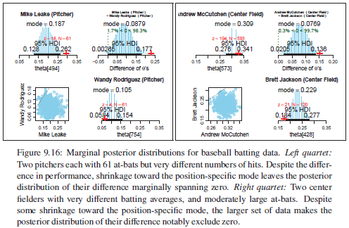

=> Same position with different batting records

**Summary of example**
shrinkage of individual-ability estimates based on category (fielding position) </br>
: Players with many at-bats (large $N_{s}$) had somewhat less shrinkage of their individual estimates </br>
than players with few at-bats (small $N_{s}$), who had estimates dominated by the position information.

If not categorize by position, </br>
the estimated abilities of any two players with identical batting records </br>
would also be identical regardless of their positions.

=> The parameter estimates are meaningful descriptions of the data only in the
context of the model structure.


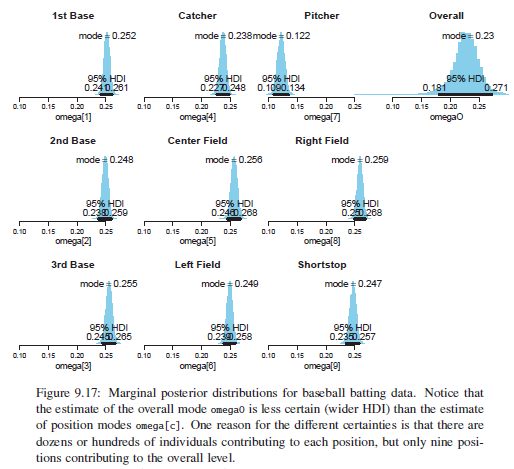

9 position parameters ($\omega_{c}$) contributing to the overall mode ($\omega$), </br>
but dozens or hundreds of players ($\theta_{s}$) contributing to each position ($\omega_{c}$).

=> The certainty of estimate at the overall level is less than the certainty of estimate
within each position.

=> If there are only a few categories, the overall level typically is not estimated very precisely.

Test for all the 968 parameters: </br>
In traditional statistical testing based on p-values, we would pay a penalty for even intending to make more comparisons. </br>
In a Bayesian analysis, decisions are based on the posterior distribution, which is based only on the data </br>
(and the prior)

## 9.6. EXERCISES
Look for more exercises at https://sites.google.com/site/doingbayesiandataanalysis/


