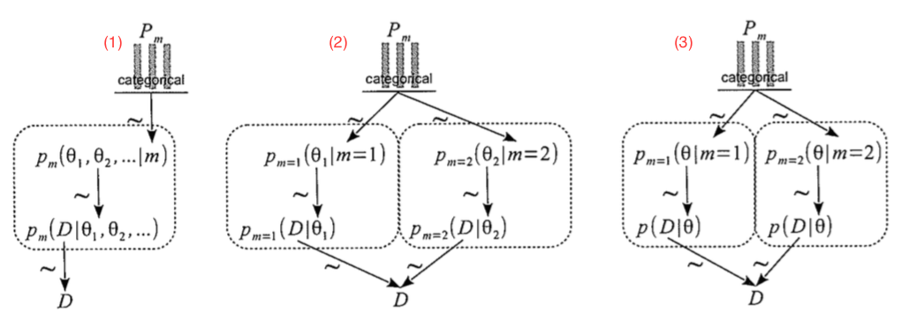
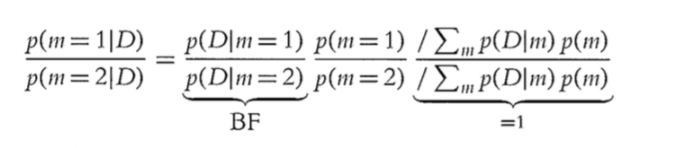
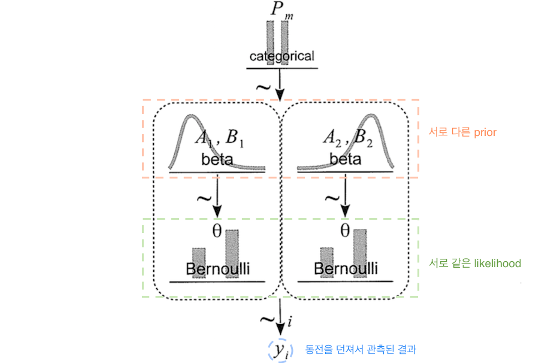
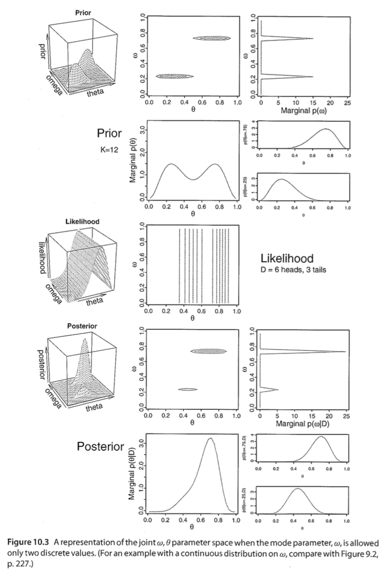
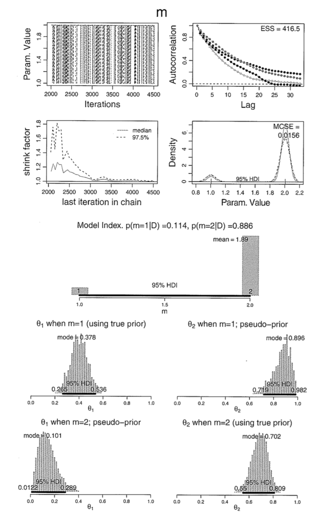

### 0. 감잡기
* Basic Idea: 모형 비교에서 Bayesian Inference를 활용한다
    + model = likelihood function + prior distribution
* 이전의 상황: __하나의__ 모형 안에서 연속형 parameter를 추정, top-level parameter를 활용한 hierarchical modeling.
* 지금의 상황: __여러__ 모형이 있을 때, top-level parameter가 model index인 상황.


### 1. 핵심 개념
  
* 동일한 데이터에서 다양한 모형이 나올 때 가장 적합한 모형을 선택해야 하는 상황인데
* 베이지안 접근법으로 얘기하자면, 각 모형의 확률값에 대한 상대적 신뢰도(Relative credibilities)를 재분배(reallocation)하는 상황
* How: 각 모형의 the prior distribution을 marginalize한다.
* Bayes Factor의 중요성  
  
  
  
* 어떤 모형 $m$을 Bayes' Rule로 표현하면:
$$
p({ \theta  }_{ 1 },{ \theta  }_{ 2 },\quad ...\quad ,\quad m|D)\quad =\quad \frac { p(D|{ \theta  }_{ 1 },{ \theta  }_{ 2 },\quad ...\quad ,\quad m)p({ \theta  }_{ 1 },{ \theta  }_{ 2 },\quad ...\quad ,\quad m) }{ \sum _{ m }^{  }{ \int _{  }^{  }{ p(D|{ \theta  }_{ 1 },{ \theta  }_{ 2 },\quad ...\quad ,\quad m)\quad p({ \theta  }_{ 1 },{ \theta  }_{ 2 },\quad ...\quad ,\quad m)\quad d{ \theta  }_{ m } }  }  } \\ \qquad \qquad \qquad \qquad =\quad \frac { \prod _{ m }^{  }{ { p }_{ m }(D|{ \theta  }_{ m },m){ p }_{ m }({ \theta  }_{ m }|m)p(m) }  }{ \sum _{ m }^{  }{ \int _{  }^{  }{ \prod _{ m }^{  }{ { p }_{ m }(D|{ \theta  }_{ m\quad  },m){ p }_{ m }({ \theta  }_{ m }|m)p(m) } d{ \theta  }_{ m } }  }  }    
$$
    + $D$: given data
    + $\theta$: parameters in a model
    + $m$ : the model  


* Single Hierarchical model로써의 모형 비교


    + 1. 일반적 도식화: 모든 모형의 joint parameter space
    + 2. 모형이 2개인 경우: 각 모형은 제각기의 parameter distribution을 가지고 있다
    + 3. 모형이 2개, 각 모형에 대한 likelihood가 같은 경우


* Bayes' rule은 model index에도 적용될 수 있다: 모형마다 parameter를 marginalize시키면 됨.
* 모형 m 에 대한 posterior probability:
$$
p(m\|D)=\frac { p(D|m)p(m) }{ \sum _{ m }^{  }{ p(D|m)p(m) }  } 
$$

* 모형 m에서 모든 parameter값에 대한 marginalize를 시키면,
$$
p(D\| m)=\int { { p }_{ m }(D|{ \theta  }_{ m },m){ p }_{ m }({ \theta  }_{ m }|m) } d{ \theta  }_{ m }
$$
* 모형은 단순히 likelihood function으로 기능할 뿐만 아니라, parameter에 대한 prior에 대한 역할을 함을 알 수 있다.  __완전중요__
* 이에 따라, 베이지안 모형 비교가 prior의 선택에 따라 매우 민감해질 수 있다.


* Bayes' Factor: 비교하는 두 모형에 대한 확률의 비율
* 두 모형에 대한 posterior odds은 결국 Bayes factor와 두 모형의 prior odds의 곱과 값다:

* Bayes Factor는 결국 데이터가 주어졌을 때, 얼마나 prior odds가 변화하는지를 나타내준다.
* 통상적으로 BF가 3.0이 넘으면 모형1에 대한, 1/3보다 작으면 모형2에 대한 "충분한 증거"가 있다고 간주 (Jefferys, 1961; Kass & Raftery, 1995; Wetzels et al., 2011)


###2. 예시상황

__동전을 만드는 공장__  


* 뒷면(tail)에 편향된 공장:
    + mode $\omega$ = 0.25, consistency $\kappa$=15
    + bias $\theta$:
$$\theta \sim  beta(\theta |{ \omega  }_{ 1 }(\kappa -2)+1, (1-{ \omega  }_{ 1 })(\kappa -2)+1) = beta(\theta |3.5,8.5)$$


* 앞면(head)에 편향된 공장: 
    + mode $\omega$ = 0.75, consistency $\kappa$=15
    + bias $\theta$:
$$\theta \sim beta(\theta |{ \omega  }_{ 2 }(\kappa -2)+1, (1-{ \omega  }_{ 2 })(\kappa -2)+1) = beta(\theta |8.5,3.5)$$

* 그림으로 이해하면:



Q:
동전을 9번 던져서 6번의 앞면이 나왔다고 할 때, __앞면위주로 만드는 공장__에서 동전이 왔을 경우의 사후 확률과  __뒷면위주로 만드는 공장__에서 동전이 왔을 경우의 사후 확률을 어떻게 구할 것인가?

* 3가지 방법으로 접근할 에정
    + formal analysis
    + grid approximation
    + MCMC


###2.1. Solution by Formal Analysis

* Ch6에서 수학적으로 계산한 것과 같은 approach
* $p(D\| m)$을 계산할 때 다음과 같은 식을 재활용
$$
p(z,N)\quad =\quad \frac { B(z+a,N-z+b) }{ B(a,b) } 
$$

* R로 이를 계산하려 할 때
```{r}
# 원래 쓰는 함수
pD <- function(z,N,a,b){exp(beta(z+a,N-z+b) - beta(a,b))}

# 조금 더 robust하도록 log를 취한 beta lbeta를 씀
pD <- function(z,N,a,b){exp(lbeta(z+a,N-z+b) - lbeta(a,b))}
```

* prior를 계산해보자:
    + 뒷면(tail) 편향 공장($m=1$)의 경우:
    $$p(D|m=1)\quad =\quad p(z,N|m=1)\quad =\quad \frac { B(z+{ a }_{ 1 },N-z+{ b }_{ 1 }) }{ B({ a }_{ 1 },{ b }_{ 1 }) }$$
    ```{r}
    pD1 <- pD(z=6,N=9,a=3.5,b=8.5)
    ```
    + 앞면(head) 편향 공장($m=2$)의 경우:
    $$p(D|m=2)\quad =\quad p(z,N|m=2)\quad =\quad \frac { B(z+{ a }_{ 2 },N-z+{ b }_{ 2 }) }{ B({ a }_{ 2 },{ b }_{ 2 }) }$$
    ```{r}
    pD2 <- pD(z=6,N=9,a=8.5,b=3.5)
    ```
    + Bayes Factor 계산: $$p(D|m=1)/p(D|m=2)$$
    ```{r}
    pD1/pD2
    ```
* Bayes Factor를 posterior 확률로 변환해보자
    + 모형에 대한 prior 확률이 p(m=1) = p(m=2) = 0.5 라고 가정
$$
\frac { p(m=1|D) }{ p(m=2|D) } \quad =\quad 0.213\\ \frac { p(m=1|D }{ 1-p(m=1|D) } =\quad 0.213\\ p(m=1|D)\quad =\quad \frac { 0.213 }{ 1+0.213 } \quad \approx \quad 0.176
$$
    + 따라서 $p(m=2|D)\quad =\quad 82.4%$가 된다.
* 주어진 데이터(9번 던졌더니 6개가 앞면)이 이전에 50:50 이던 모형에 대한 신뢰도를 17.6:82.4로 변화시켰다.
* 확연히 다른 경향이 모형이 주어지면, 아주 적은 데이터만으로도 특정 모형에 대한 선호가 두드러지게 된다.
* 그런데, 위에서 소개한 방법은 상대적인 확률에 대한 정보만 줄 뿐, $p(\theta |D,m)$, 즉 동전에 대한 bias를 계산하지는 못한다. 


###2.2 Solution by Grid Approximation


* parameter space를 시각적으로 볼 수 있다.
* 모형 $m=1$과 $m=2$는 mode값인 ${\omega}_{m}$으로 서로 구분됨




* 동전이 $\theta=0.7$ 정도의 편향을 가지고 있음을 확인할 수 있음


##3. Solution by MCMC
* 복잡한 모형의 경우, $p(D|m)$을 직접 계산하거나, grid approximation을 하는 것이 불가능함
* MCMC를 활용해서 prior distribution을 approximate
* 크게 두 가지 방법으로 MCMC를 할 수 있음
    + 모형 각각에 대해 $p(D|m)$을 계산 (non-hierarchical)
    + model index에 서로 다른 값으로 MCMC를 시행해 posterior 확률을 계산해냄


###3.1 Nonhierarchical MCMC Computation
* 모형 $m$의 $p(D|m)$를 계산하는 방법을 알아보자
* 복잡한 모형에 적용하기는 어려움으로 실생활에서는 잘 쓰이지 않는 방법. 
* 우선 확률분포함수(probability distribution function)를 approximation하는 방법은 
$$
\int { \quad f({ \theta  })p({ \theta  })\quad d\theta \quad \approx \quad \frac { 1 }{ N } \sum _{ { \theta  }_{ i }\sim p(\theta ) }^{ N }{ f({ \theta  }_{ i }) }  } 
$$
* 이를 모형 비교 상황에 적용하면
$$
p(D)\quad =\int { \quad p(D|\theta )p(\theta )d\theta \quad \approx \quad \frac { 1 }{ N } \sum _{ { \theta  }_{ i }p(\theta ) }^{ N }{ p(D|{ \theta  }_{ i }) }  } 
$$
    + 샘플링된 거의 모든 값에 대해 $p(D|\theta)가 거의 0임
    + 특정 값으로 수렴하게 만들려면 엄청엄청엄청나게 많은 샘플이 필요함
    
* 따라서 prior에서 샘플링을 하는 대신에 MCMC 샘플을 써보도록 하자
    + 베이즈 정리 원형
    $$
    p(\theta |D)\quad =\quad \frac { p(D|\theta )p(\theta ) }{ p(D) } 
    $$
    + 변형된 베이즈정리
    $$
    \quad \frac { 1 }{ p(D) } =\frac { p(\theta |D) }{ p(D|\theta )p(\theta ) } 
    $$
    + 여기에 마술을 부려서
$$
\frac { 1 }{ p(D) } \quad =\quad \frac { p(\theta |D) }{ p(D|\theta )p(\theta ) } \quad =\quad \frac { p(\theta |D) }{ p(D|\theta )p(\theta ) } \int { h(\theta )d\theta  } \\ =\int { \frac { h(\theta ) }{ p(D|\theta )p(\theta ) } p(\theta |D) } \\ \approx \quad \frac { 1 }{ N } \sum _{ { \theta  }_{ i } \sim p(\theta |D) }^{ N }{ \frac { h({ \theta  }_{ i }) }{ p(D|{ \theta  }_{ i })p({ \theta  }_{ i }) }  } \\ 
$$

* $h(\theta)$를 흉내내는 과정
* 복잡한 모형에는 제대로 작용하지 못할 수 있다.

__3.1.1 JAGS 활용__  


* $p(D)$를 계산하기 위해서 MCMC 결과를 활용
* Jags-Ydich-Xnom1subj-Mbernbeta.R에서 문제의 상황에 맞춰 코드를 변경
* $m=2$의 경우,  $\omega=0.75$ $\kappa=12$였던 prior를 다음과 같이 바꾸어 준다:
```{r}
source("Jags-Ydich-Xnom1subj-Mbernbeta_ver1.R")
modelString = "
    model {
  for (i in 1:Ntotal) {
    y[i] ~ dbern(theta)
  }
  theta ~ dbeta( 0.75*(12-2)+1, (1-0.75)*(12-2)+1)
}
  "
```

* MCMC posterior sample 생성
```{r}
myData = c(rep(0,9-6), rep(1,6))
mcmcCoda = genMCMC(data=myData, numSavedSteps=10000)
theta = as.matrix(mcmcCoda)[,"theta"]
```

* $p(D)$를 계산
```{r}
meanTheta = mean(theta)
sdTheta = sd(theta)

aPost = meanTheta * (meanTheta*(1-meanTheta)/sdTheta^2 - 1)
bPost = (1 - meanTheta) * (meanTheta*(1-meanTheta)/sdTheta^2 - 1)

oneOverPD = mean( dbeta(theta, aPost, bPost) / (theta^6*(1-theta)^(9-6) * dbeta(theta, 0.75*(12-2)+1, (1-0.75)*(12-2)+1)))

PD = 1/oneOverPD

show(PD)
```

* formal analysis에서 나온 결과와 근사한 것을 확인 할 수 있다.


###3.2 Hierarchical MCMC Computation of Relative Model Probability

* full hierarchical 구조
* Jags-Ydich-Xnom1subj-MbernBetaModelComp.R를 활용할 예정
* 이런 식을
$$
\frac { \prod _{ m }^{  }{ { p }_{ m }(D|{ \theta  }_{ m },m){ p }_{ m }({ \theta  }_{ m }|m)p(m) }  }{ \sum _{ m }^{  }{ \int _{  }^{  }{ \prod _{ m }^{  }{ { p }_{ m }(D|{ \theta  }_{ m\quad  },m){ p }_{ m }({ \theta  }_{ m }|m)p(m) } d{ \theta  }_{ m } }  }  } 
$$
* JAGS에서 다음과 같이 구현

```{r, echo=FALSE}
graphics.off()
rm(list=ls(all=TRUE))
source("DBDA2E-utilities.R")
require(rjags)
fileNameRoot="Jags-Ydich-Xnom1subj-MbernBetaModelComp-" # for output filenames
```


* 데이터
```{r}
#------------------------------------------------------------------------------
# THE DATA.

N=9
z=6
y = c( rep(0,N-z) , rep(1,z) )
dataList = list(
  y = y ,
  N = N 
)

#------------------------------------------------------------------------------
```


* 모형
* Bernoulli likelihood function과 beta prior distribution이 두 모델 모두에 관여하는 경우, 필수는 아님
* omega로 model index를 명시
```{r}
modelString = "
model {
  for ( i in 1:N ) {
    y[i] ~ dbern( theta )
  }
  theta ~ dbeta( omega[m]*(kappa-2)+1 , (1-omega[m])*(kappa-2)+1 ) 
  omega[1] <- .25
  omega[2] <- .75
  kappa <- 12
  m ~ dcat( mPriorProb[] )
  mPriorProb[1] <- .5
  mPriorProb[2] <- .5
}
"
writeLines( modelString , con="TEMPmodel.txt" )

```


* chain 돌리기
```{r}
# RUN THE CHAINS.

parameters = c("theta","m") 
adaptSteps = 1000             # Number of steps to "tune" the samplers.
burnInSteps = 1000           # Number of steps to "burn-in" the samplers.
nChains = 4                   # Number of chains to run.
numSavedSteps=50000          # Total number of steps in chains to save.
thinSteps=1                   # Number of steps to "thin" (1=keep every step).
nPerChain = ceiling( ( numSavedSteps * thinSteps ) / nChains ) # Steps per chain.
# Create, initialize, and adapt the model:
jagsModel = jags.model( "TEMPmodel.txt" , data=dataList , # inits=initsList , 
                        n.chains=nChains , n.adapt=adaptSteps )
# Burn-in:
cat( "Burning in the MCMC chain...\n" )
update( jagsModel , n.iter=burnInSteps )
# The saved MCMC chain:
cat( "Sampling final MCMC chain...\n" )
codaSamples = coda.samples( jagsModel , variable.names=parameters , 
                            n.iter=nPerChain , thin=thinSteps )
# resulting codaSamples object has these indices: 
#   codaSamples[[ chainIdx ]][ stepIdx , paramIdx ]

save( codaSamples , file=paste0(fileNameRoot,"Mcmc.Rdata") )
```

* chain 상태 진단
```{r}
# Display diagnostics of chain:

parameterNames = varnames(codaSamples) # get all parameter names
for ( parName in parameterNames ) {
  diagMCMC( codaSamples , parName=parName ,
            saveName=fileNameRoot , saveType="eps" )
}
```

* 결과

```{r}
# Convert coda-object codaSamples to matrix object for easier handling.
mcmcMat = as.matrix( codaSamples , chains=TRUE )
m = mcmcMat[,"m"]
theta = mcmcMat[,"theta"]

# Compute the proportion of m at each index value:
pM1 = sum( m == 1 ) / length( m )
pM2 = 1 - pM1

# Extract theta values for each model index:
thetaM1 = theta[ m == 1 ]
thetaM2 = theta[ m == 2 ]

# Plot histograms of sampled theta values for each model,
# with pM displayed.
openGraph(width=7,height=5)
par( mar=0.5+c(3,1,2,1) , mgp=c(2.0,0.7,0) )
layout( matrix(c(1,1,2,3),nrow=2,byrow=FALSE) , widths=c(1,2) )
plotPost( m , breaks=seq(0.9,2.1,0.2) , cenTend="mean" , xlab="m" , main="Model Index" )
plotPost( thetaM1 , 
          main=bquote( theta*" when m=1" * " ; p(m=1|D)" == .(signif(pM1,3)) ) , 
          cex.main=1.75 , xlab=bquote(theta) , xlim=c(0,1) )
plotPost( thetaM2 , 
          main=bquote( theta*" when m=2" * " ; p(m=2|D)" == .(signif(pM2,3)) ) , 
          cex.main=1.75 , xlab=bquote(theta) , xlim=c(0,1) )
saveGraph( file=paste0(fileNameRoot,"Post") , type="eps" )
```


__3.2.1 pseudo-prior를 활용하여 자기 상관(autocorrelation)을 줄이기__

* MCMC random walk의 각 단계에서 JAGS는 주어진 데이터로 $m$, ${\theta}_{1}$,${\theta}_{2}$를 만들어냄
* 이때, chain의 각 단계에서 $m=1$의 경우 ${\theta}_{1}$, $m=2$의 경우 ${\theta}_{2}$만 데이터를 설명하는 데 쓰이고(prior에 영향을 받으면서) 나머지 하나는 둥둥 데이터에 상관없이 떠다님


* 기존에 사용하는 MCMC
```{r}
modelString = "
model {
  for (i in 1:N){
    y[i] ~ dbern(theta)
  }
  theta <- equals(m,1)*theta1 + equals(m,2)*theta2
  theta1 ~ dbeta(omega1*(kappa1-2)+1, (1-omega1)*(kappa1-2)+1)
  omega1 <- .25
  kappa1 <- 12
  
  thetaq ~ dbeta(omega2*(kappa2-2)+1, (1-omega2)*(kappa2-2)+1)
  omega2 <- .75
  kappa2 <- 12
  
  m ~ dcat(mPriorProb[])
  mPriorProb[1] <- .5
  mPriorProb[2] <- .5
}
"
```


* model index를 위한 chain이 매우 자기상관이 강할 수가 있다: chain이 다음 모델 순서전까지 이전 모형에 남아있을 수 있음.

* pseudo prior를 활용해서 chain이 모형간에 잘 활용될 수 있도록 도와줄 수 있음
* "Jags-Ydich-Xnom1subj-MbernBetaModelCompPseudoPrior.R" 참조


```{r,echo=FALSE}
graphics.off()
rm(list=ls(all=TRUE))
source("DBDA2E-utilities.R")
require(rjags)
fileNameRoot="Jags-Ydich-Xnom1subj-MbernBetaModelCompPseudoPrior-PSEUDO-" 
```

* 데이터 
```{r}
# THE DATA.

N=30
z=ceiling(.55*N)
y = c( rep(0,N-z) , rep(1,z) )
dataList = list(
  y = y ,
  N = N 
)

```

```{r}

modelString = "
model {
  for ( i in 1:N ) {
    y[i] ~ dbern( theta )
  }
  theta <- equals(m,1)*theta1 + equals(m,2)*theta2
  theta1 ~ dbeta( omega1[m]*(kappa1[m]-2)+1 , (1-omega1[m])*(kappa1[m]-2)+1 ) 
  omega1[1] <- .10 # true prior value
  omega1[2] <- .40 # pseudo prior value
  kappa1[1] <- 20 # true prior value
  kappa1[2] <- 50 # pseudo prior value
  theta2 ~ dbeta( omega2[m]*(kappa2[m]-2)+1 , (1-omega2[m])*(kappa2[m]-2)+1 ) 
  omega2[1] <- .70 # pseudo prior value
  omega2[2] <- .90 # true prior value
  kappa2[1] <- 50 # pseudo prior value
  kappa2[2] <- 20 # true prior value
  m ~ dcat( mPriorProb[] )
  mPriorProb[1] <- .5
  mPriorProb[2] <- .5
}
" 
writeLines( modelString , con="TEMPmodel.txt" )
```

* chain돌리기 
```{r}
# RUN THE CHAINS.

parameters = c("m","theta1","theta2") 
adaptSteps = 1000            # Number of steps to "tune" the samplers.
burnInSteps = 1000           # Number of steps to "burn-in" the samplers.
nChains = 4                  # Number of chains to run.
numSavedSteps=10000          # Total number of steps in chains to save.
thinSteps=1                  # Number of steps to "thin" (1=keep every step).
nPerChain = ceiling( ( numSavedSteps * thinSteps ) / nChains ) # Steps per chain.
# Create, initialize, and adapt the model:
jagsModel = jags.model( "TEMPmodel.txt" , data=dataList , # inits=initsList , 
                        n.chains=nChains , n.adapt=adaptSteps )
# Burn-in:
cat( "Burning in the MCMC chain...\n" )
update( jagsModel , n.iter=burnInSteps )
# The saved MCMC chain:
cat( "Sampling final MCMC chain...\n" )
codaSamples = coda.samples( jagsModel , variable.names=parameters , 
                            n.iter=nPerChain , thin=thinSteps )
# resulting codaSamples object has these indices: 
#   codaSamples[[ chainIdx ]][ stepIdx , paramIdx ]

save( codaSamples , file=paste0(fileNameRoot,"Mcmc.Rdata") )
```

* 결과
* pseudo-prior를 사용하지 않은 경우


```{r}
# EXAMINE THE RESULTS.

# Convert coda-object codaSamples to matrix object for easier handling.
mcmcMat = as.matrix( codaSamples , chains=TRUE )
m = mcmcMat[,"m"]
# Compute the proportion of m at each index value:
pM1 = sum( m == 1 ) / length( m )
pM2 = 1 - pM1
# Extract theta values for each model index:
theta1M1 = mcmcMat[,"theta1"][ m == 1 ] # true theta1
theta1M2 = mcmcMat[,"theta1"][ m == 2 ] # pseudo theta1
theta2M1 = mcmcMat[,"theta2"][ m == 1 ] # pseudo theta2
theta2M2 = mcmcMat[,"theta2"][ m == 2 ] # true theta2

# Plot histograms of sampled theta values for each model,
# with pM displayed.
openGraph(width=7,height=7)
par( mar=0.5+c(3,1,2,1) , mgp=c(2.0,0.7,0) )
layout( matrix(c(1,1,2,3,4,5),nrow=3,byrow=TRUE)   )
plotPost( m , breaks=seq(0.95,2.05,0.1) , xlim=c(0.75,2.25) , 
          cenTend="mean" , xlab="m" , cex.main=1.75 ,
          main=bquote( "Model Index." * 
                         " p(m=1|D) =" * .(signif(pM1,3)) *
                         ", p(m=2|D) =" * .(signif(pM2,3)) ) )
plotPost( theta1M1 , 
          main=bquote( theta[1]*" when m=1 (using true prior)" ) , 
          cex.main=1.75 , xlab=bquote(theta[1]) , xlim=c(0,1) )
plotPost( theta2M1 , 
          main=bquote( theta[2]*" when m=1; pseudo-prior" ) , 
          cex.main=1.75 , xlab=bquote(theta[2]) , xlim=c(0,1) )
plotPost( theta1M2 , 
          main=bquote( theta[1]*" when m=2; pseudo-prior" ) , 
          cex.main=1.75 , xlab=bquote(theta[1]) , xlim=c(0,1) )
plotPost( theta2M2 , 
          main=bquote( theta[2]*" when m=2 (using true prior)" ) , 
          cex.main=1.75 , xlab=bquote(theta[2]) , xlim=c(0,1) )
saveGraph( file=paste0(fileNameRoot,"Post") , type="eps" )
```

### 3.3 서로 다른 "noise"가 있는 모델
* 지금까지의 예제는 모든 모형에 대한 pdf, 즉 $p(D|\theta)$가 모두 같은 상황이었음
* probability distribution을 때때로 noise distribution이라고 부름 (random variability)
* 그러나 실생활에서는 모형들이 서로다른 데이터를 표현하는 경우가 있
* MCMC 과정에서, 서로 다른 distribution 가정에 대한   likelihood를 계산해서 비교하여 선택가능
* JAGS에서 pdf1, pdf2 등으로 명시해줄 수 있다.

```{r}
#data
#  C <- 10000
#  for (i in 1:N) {
#    ones[i] <- 1
#

#model
modelString = "
model {
  for (i in 1:N) {
    spy1[i] <- pdf1( y[i] , parameters1)/C
    spy2[i] <- pdf2( y[i] , parameters2)/C
    spy[i] <- equals(m,1)*spy1[i] + equals(m,2)*spy2[i]
    ones[i] ~ dbern(spy[i])
  }
  parameters1 ~ dprior1...
  parameters2 ~ dprior2...
  m ~ dcat( mPriorProb[])
  mPriorProb[1] <- .5
  mPriorProb[2] <- .5
}
"
```


##4. 예측: Model Averaging

* 일반적으로 model을 compare할 때 best model을 선정하는 경향
* 그러나 hierarchical structure가 정말 잘 우리의 prior belief를 반영한다면, 모델 각각에 weight가 반영된 모형이 가장 완벽할 것이다.

$$
p(\overset { \wedge  }{ y } |D)\quad =\quad \sum _{ m }^{  }{ p(\overset { \wedge  }{ y } |D,m)p(m|D) } \\ =\quad \sum _{ m }^{  }{ \int { { \theta  }_{ m }{ p }_{ m }(\overset { \wedge  }{ y } |{ \theta  }_{ m },m){ p }_{ m }({ \theta  }_{ m }|D,m)p(m|D)\quad d{ \theta  }_{ m } }  } 
$$


##5. Model Complexity

* 복잡한(Complex) 모형이 단순한(Simple) 모형보다 주어진 데이터를 __항상__ 더 잘표현하는 경향이 있음
* 그러나 데이터가 random noise에 의해 오염돼있을 가능성이 있으므로, 항상 복잡한 모형을 선호할수만은 없다. 
* Bayesian Model Comparison의 장점: parameter들의 prior distribution에 의해 주어진 데이터에 따라 자연적으로 복잡한 모형을 선호하게 되는 경향을 보정해줄 수 있음
    + 복잡한 모형은 prior가 parameter space에 얇고 넓게 분포해 있게 된다.

* 예: 동전찍는 두 공장에 대한 두 가지 모형이 있을 떄:
    + 모형1 (단순한 모형): ${\omega}_{s}=0.5$, ${\kappa}_{s}=1000$
    + 모형2 (복잡한 모형): ${\omega}_{s}=0.5$, ${\kappa}_{s}=2$
* 동전을 20번 던져 15개의 앞면이 나온 데이터
```{r}
z=15; N=20; pD(z,N,a=500,b=500)/pD(z,N,a=1,b=1)
```
* 동전을 20번 던져 11개의 앞면이 나온 데이터
```{r}
z=11; N=20; pD(z,N,a=500,b=500)/pD(z,N,a=1,b=1)
```

* Bayesian Model Comparison에서는, 일관적인 데이터가 주어지면 복잡한 모형이 fitting을 똑같이 잘 해도 simple한 모형이 선택될 수 있다.


###5.1 Nested model comparison의 위험

* nested model: full model에 비교되는 reduced model
* model complexity와 마찬가지로, 일반적인 model comparison 상황에서는 항상 full model이 win할 것
* 그러나 Bayesian Model Comparison에서는, 만약 주어진 데이터가 restricted model에 의해 잘 설명될 수 있으면, restricted model을 선호하게 될 것


##6. Prior Distribution에 대한 지나친 민감도
* Bayesian Model Comparison에서 Bayes Factor가 prior distribution에 많은 영향을 끼침.
* 일반적인 continuous parameter를 bayes 추론할 때, prior의 불확실성에 상관없이 posterior가 robust하다는 점과 차이가 있음.


* prior가 불명확하면 모형의 marginal likelihood에 영향을 주어 궁극적으로 다른 모형과 비교시 Bayes Factor에도 영향을 줌
* 아예 parameter prior가 확연히 다른 모형들을 비교할 때, 동등한 수준에서 비교하기가 힘들어짐
* 대안: 작은 대표성있는 샘플로 prior를 만들어서 모든 모형에 동일하게 적용할 수 있음

* 두가지 prior를 비교:
    + prior1: a=500, b=500 (${\omega}_{s}=0.5$, ${\kappa}_{s}=1000$)
    + prior2: a=1, b=1 (${\omega}_{s}=0.5$, ${\kappa}_{s}=2$)
```{r}
z=65; N=100; pD(z,N,a=500,b=500)/pD(z,N,a=1,b=1)
```

* 위 상황의 prior는 uniform distribution을 가정한 상황임
* Haldane prior(0에 매우 가까운 shape parameter를 가지는 prior)를 사용한다면? 
```{r}
z=65; N=100; pD(z,N,a=500,b=500)/pD(z,N,a=0.01,b=0.01)
```


###6.1. Priors of different models should be equally informed

* 그러면 어떻게 해결?
* 모형적합에 쓸 데이터의 일부분을 떼어내어 각 모형의 prior에 정보를 준다
* 위의 예시에서 데이터의 10%를 떼어냈다고 치자(10번 던져서 6면의 앞면이 나옴)
* prior1의 경우
```{r}
z=65-6; N=100-10; pD(z,N,a=500+6,b=500-6)/pD(z,N,a=1+6,b=1+10-6)
```

* prior2의 경우
```{r}
z=65-6; N=100-10; pD(z,N,a=500+6,b=500-6)/pD(z,N,a=0.01+6,b=0.01+10-6)
```

* Bayes Factor에 변화가 거의 없는 것을 확인할 수 있다.


<끝>  
